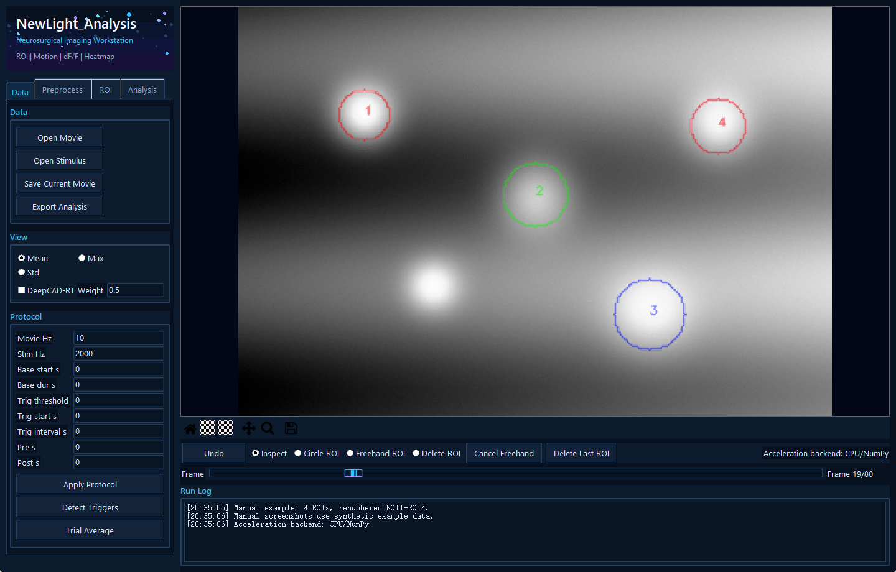
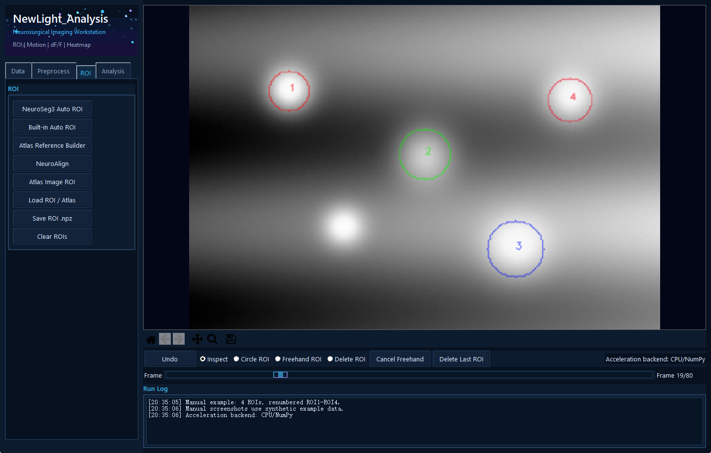
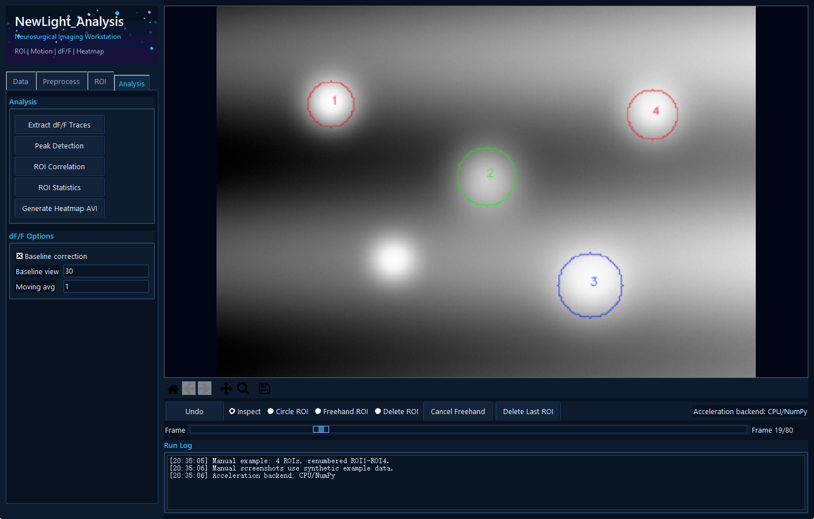
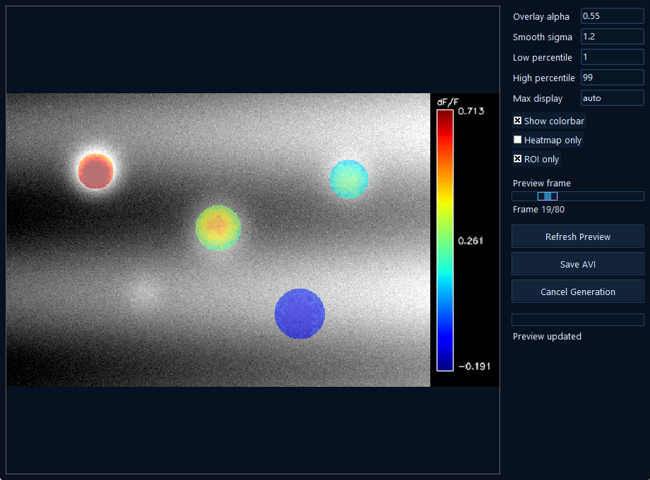
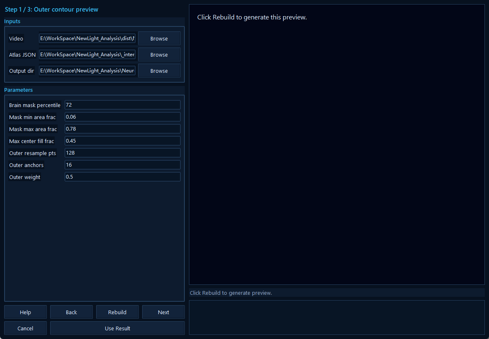

# NewLight_Analysis 用户使用手册

便携版 / 适用于 2026-05-14 打包输出

输出目录：`E:\WorkSpace\NewLight_Analysis\dist\NewLight_Analysis`

## 1. 快速开始

1. 进入打包目录，双击 `NewLight_Analysis.exe`。不要删除 `_internal` 文件夹；模型、后端 worker 和算法资源都在其中。
2. 在 **Data** 页点击 **Open Movie**，导入 `.tif/.tiff/.avi/.mp4/.mov/.mkv` 视频或图像序列。
3. 需要刺激同步时点击 **Open Stimulus** 导入文本/CSV/dat 信号，填写采样率与触发参数后点击 **Detect Triggers**。
4. 在 **Preprocess** 页按需要依次应用运动校正、滤波、背景扣除或血管伪影去除。当前版本的预处理会作用到当前 movie，并按点击顺序叠加。
5. 在主图窗口用 **Circle ROI** 或 **Freehand ROI** 圈选 ROI；也可在 **ROI** 页使用自动 ROI 或图谱导入。
6. 在 **Analysis** 页点击 **Extract dF/F Traces**，再做峰值、相关、统计或热图 AVI。
7. 点击 **Save Current Movie** 保存当前处理后的 movie；点击 **Export Analysis** 导出分析表格、ROI、图像和摘要。

## 2. 安装、运行与文件结构

- 便携版目标是“用户安装或复制后即可用”。正常使用不需要用户额外安装 Python、conda 或项目源码。
- GPU 功能依赖目标电脑的 NVIDIA 驱动和 CUDA 运行环境；没有 CUDA 时，软件会尽量回退到 CPU 或给出后端错误。
- `_internal` 包含 `NewLight_Worker.exe`、DeepCAD-RT 模型、NeuroSeg3 权重、CaImAn/NeuroAlign/DeepCAD-RT 后端资源。
- `Example` 包含示例输入文件，可用于第一次运行测试。
- 软件会在系统临时目录创建会话临时文件，关闭程序时清理；正式输出只由 **Save Current Movie** 或 **Export Analysis** 写入。

## 3. 界面总览

主界面由左侧功能区、右侧图像显示区、Matplotlib 工具栏、ROI 交互工具栏、帧滑块和 Run Log 组成。显示区会按当前可见窗口自动居中适配，并保持原始图像宽高比。



*图 1. Data 页：导入、显示模式、DeepCAD-RT 预览、实验协议和触发检测。*


*图 2. Preprocess 页：运动校正、滤波、背景扣除、漂白校正和血管伪影处理。*



*图 3. ROI 页：手动画 ROI、自动 ROI、Atlas Reference Builder 和 NeuroAlign 入口。*



*图 4. Analysis 页：dF/F 提取、峰值、相关、统计和热图 AVI。*



*图 5. Heatmap AVI 参数窗口：热图透明度、强度范围、右侧 colorbar 和 ROI-only 预览。*



*图 6. NeuroAlign 三步向导：外轮廓预览、聚类预览和最终图谱导入。*

## 4. Data 页

| 控件 | 作用 | 论文/数据注意点 |
| --- | --- | --- |
| Open Movie | 导入实验 movie。TIF/TIFF 作为帧堆栈，AVI/常见视频格式由 OpenCV 读取。 | 记录帧率、帧数、空间分辨率和是否进行过预处理。 |
| Open Stimulus | 导入刺激信号。 | 刺激采样率必须正确，否则触发时间到 movie 帧的映射会偏移。 |
| Save Current Movie | 弹出保存窗口，默认进入原始输入文件夹，默认名 `result.<ext>`。 | 保存的是当前 movie；若 DeepCAD-RT 开启且缓存可用，则保存 raw/denoised blend。 |
| Export Analysis | 导出 trace、ROI、统计表、热图和 summary JSON。 | 建议每次正式分析都导出，便于论文方法和复现。 |
| Mean / Max / Std | 显示当前 movie 的均值、最大值或标准差投影。 | 这些只是显示投影，不改变原始 movie 数据。 |
| DeepCAD-RT | 对当前 movie 做去噪预览并缓存结果。 | DeepCAD-RT 是显示/保存 overlay，不会直接替换 `state.movie`。 |
| Weight | raw 与 DeepCAD-RT 去噪结果的混合权重。 | `Weight=0` 为原图，`Weight=1` 为去噪图；它不是 DeepCAD 后端 patch overlap。 |

### Data 页计算

投影图：

```text
Mean(x,y) = mean_t F_t(x,y)
Max(x,y)  = max_t  F_t(x,y)
Std(x,y)  = std_t  F_t(x,y)
```

DeepCAD-RT 显示/保存混合：

```text
F_blend(t,x,y) = (1 - w) * F_current(t,x,y) + w * F_denoised(t,x,y)
0 <= w <= 1
```

触发检测：

```text
threshold_auto = mean(stimulus) + 2 * std(stimulus)
threshold      = max(user_threshold, threshold_auto)
trigger_samples = rising_edges(stimulus > threshold)
movie_frame = round((trigger_sample / stim_fs) * movie_fs)
```

如果不导入 stimulus，也可以用 `Trig start s` 和 `Trig interval s` 生成等间隔触发：

```text
start_frame = round(start_s * movie_fs)
step_frame  = round(interval_s * movie_fs)
trigger_frames = start_frame, start_frame + step_frame, ...
```

## 5. Preprocess 页

预处理按钮会修改当前 movie，并且多个预处理按点击顺序叠加。每次处理会清空 DeepCAD-RT 预览缓存，并重新计算基线和显示投影。若结果不满意，可用下方 **Undo** 回退最近一次 movie 操作。

| 功能 | 用途 | 核心方法/公式 |
| --- | --- | --- |
| CaImAn Motion | 调用 CaImAn 后端做 rigid 或 piecewise 运动校正。 | 适合真实成像数据的运动漂移；论文中建议引用 CaImAn 原方法并报告模式。 |
| Rigid Motion (Built-in) | 内置刚性平移校正。 | 模板为前 N 帧均值；用 phase cross-correlation 估计每帧平移。 |
| Gaussian Smooth | 空间高斯平滑，降低高频噪声。 | `F' = G_sigma(x,y) * F`，时间轴不平滑。 |
| Median Filter | 逐帧中值滤波，抑制椒盐噪声。 | `F'_t(x,y)=median` of local spatial window。 |
| Background Subtract | 扣除低频背景。 | `B_t = Gaussian(F_t, sigma)`, `F'_t = F_t - B_t`, 再整体平移使最小值为 0。 |
| Bleach Correction | 校正随时间缓慢漂白。 | 对全图均值 trace 拟合二次趋势并从每帧扣除中心化趋势。 |
| Enhance Contrast | 增强局部对比。 | 逐帧归一化后做 CLAHE/adapthist。 |
| Detect Vessels | 检测血管或条带伪影区域。 | 优先 Frangi vesselness，失败时用 Sobel；按 percentile 阈值生成 mask。 |
| Remove Vessel Artifact | 用未 mask 区域的帧内中位数替换 mask 像素。 | `F'_t(mask)=median(F_t(unmasked))`。 |

主要预处理公式：

```text
Gaussian smooth:      F'_t = gaussian_filter(F_t, sigma=(sigma_x, sigma_y))
Median filter:        F'_t(x,y) = median_{(u,v) in window(x,y)} F_t(u,v)
Background subtract:  B_t = gaussian_filter(F_t, sigma), F'_t = F_t - B_t - min(F_t - B_t)
Bleach correction:    m(t)=mean_xy F_t(x,y)
                      p(t)=a*t^2+b*t+c
                      F'_t(x,y)=F_t(x,y)-(p(t)-mean_t p(t))
Rigid correction:     shift_t = phase_cross_correlation(template, F_t)
                      F'_t = shift(F_t, shift_t)
```

## 6. ROI 页

ROI 是后续 trace、统计和热图 mask 的基础。主图底部工具栏提供 **Circle ROI**、**Freehand ROI**、**Delete ROI** 和 **Delete Last ROI**。如果提取 trace 时没有任何 ROI，当前版本会自动建立一个全局 ROI，覆盖整张图。

| 功能 | 适用场景 | 关键参数 |
| --- | --- | --- |
| NeuroSeg3 Auto ROI | 用 YOLO/instance segmentation 自动找细胞或结构。 | `Detection conf` 是实例置信度阈值；当前 mask pixel cutoff 固定 0.50。当前数据常需较低 conf，例如 0.002 起试。 |
| Built-in Auto ROI | 不依赖模型的快速连通域 ROI。 | `Min area` / `Max area` 单位为 px^2，可用最后两个手动画 ROI 自动填入范围。 |
| Atlas Reference Builder | 从标准图谱线稿生成 `atlas_regions_raw.json`。 | 调 `Line threshold`, `Bridge gap px`, `Barrier radius`, `Min region area`。 |
| NeuroAlign | 将标准图谱配准到当前 subject movie。 | 三步：外轮廓预览 -> 聚类预览 -> 最终 atlas。支持 Back/Rebuild/Use Result。 |
| Atlas Image ROI | 直接把 PNG/JPG/TIF atlas 图像作为 ROI 导入。 | 白色/高亮区域会被识别为 ROI，按当前 frame shape 最近邻缩放。 |
| Load ROI / Atlas | 加载 `.npz` ROI 或 atlas JSON/图像。 | JSON atlas polygon 会转为当前图像尺寸下的 mask。 |
| Save ROI .npz | 保存当前 ROI masks 和名称。 | 推荐在手工修正 ROI 后保存，防止重复圈选。 |

Built-in Auto ROI 的核心流程：

```text
I_norm = clip((I - P2(I)) / (P98(I) - P2(I)), 0, 1)
I_s    = gaussian_filter(I_norm, sigma=1)
T      = Otsu(I_s)
mask   = I_s > T
ROI_i  = connected_components(mask), keep if min_area <= area_i <= max_area
estimated_diameter_px ~= 2 * sqrt(area_px / pi)
```

Atlas image ROI 的核心流程：

```text
A_norm = clip((A - P2(A)) / (P98(A) - P2(A)), 0, 1)
binary = A_norm > 0.9, or Otsu(A_norm) if no pixels pass 0.9
ROI_i  = connected_components(binary), remove area < min_area
ROI masks are resized to the current frame by nearest-neighbor interpolation
```

Atlas Reference Builder 的输出包括 `atlas_regions_raw.json`、`atlas_preview_ids_colored.png`、`atlas_preview_filled.png` 和中间 mask。线稿提取公式为：

```text
bright-line atlas: L(x,y) = 1 if gray(x,y) >= line_threshold
dark-line atlas:   L(x,y) = 1 if gray(x,y) <= line_threshold
barrier = dilate(bridge_gaps(L), disk(barrier_radius))
regions = enclosed_connected_components(not barrier), keep area >= min_region_area
```

NeuroAlign 的三步向导：

1. **Outer contour preview**：只运行 subject mask、外轮廓和 affine atlas 粗配准；mean 图以约 30% 透明度显示，便于判断外轮廓和中缝。
2. **Clustering preview**：复用第一步缓存，计算 Leiden/superpixel 聚类，并把聚类结果映射到 affine atlas 轮廓上。
3. **Final atlas preview**：复用第二步 label map，进行内边界匹配、TPS 候选评估和最终图谱输出；**Use Result** 会把 `warped_atlas_regions.json` 载入主界面 ROI。

NeuroAlign 外轮廓 affine 阶段的目标函数：

```text
E_affine = E_contour + lambda_midline * E_midline + P_rotation + P_shear
```

内边界与中缝评分：

```text
center_score  = exp(-center_dx / max(0.75*sigma, 1))
width_score   = exp(-width_dx  / max(0.45*sigma, 1))
midline_score = 0.70*center_score + 0.30*width_score
inner_score   = 0.58*midline_score + 0.42*boundary_score
```

最终 warp 综合评分：

```text
outer_term  = exp(-outer_error_px / max(affine_outer_error_px, 1))
deform_term = exp(-mean_control_point_disp / max(max_ctrl_shift_px, 1))
inner_total = 0.58*inner_agreement + 0.42*pair_score
linear = (wi*inner_total + wg*brain_iou + wo*outer_term + wd*deform_term) / (wi+wg+wo+wd)
geo    = inner_total^(wi/ws) * brain_iou^(wg/ws) * outer_term^(wo/ws) * deform_term^(wd/ws)
score  = 0.60*linear + 0.40*geo
default adaptive weights: wi=0.56, wg=0.24, wo=0.12, wd=0.08
```

## 7. Analysis 页

| 功能 | 输出 | 核心依据 |
| --- | --- | --- |
| Extract dF/F Traces | 每个 ROI 一条 dF/F trace。 | 逐像素 dF/F 后，对 ROI mask 内像素取平均。 |
| Peak Detection | 每个 ROI 的峰位置和数量。 | SciPy `find_peaks`，prominence 基于 trace 标准差。 |
| ROI Correlation | ROI x ROI Pearson 相关矩阵。 | `rho_ij = corr(r_i, r_j)`。 |
| ROI Statistics | Mean, Std, Max, Baseline_25pct, CV, Peak_Count, Trigger_Count。 | `CV = Std / abs(Mean)`。 |
| Generate Heatmap AVI | 带或不带 colorbar 的 dF/F 热图视频。 | 逐帧 dF/F 平滑、百分位归一化、与灰度原图按 alpha 混合。 |

dF/F 与 trace 提取：

```text
F0(x,y) = percentile_25_t F_t(x,y)
dFF_t(x,y) = (F_t(x,y) - F0(x,y)) / (F0(x,y) + 1e-6)
r_i(t) = (1 / |M_i|) * sum_{(x,y) in M_i} dFF_t(x,y)
```

当前 GUI 默认基线为全片逐像素 25% 分位数。`Base start s` / `Base dur s` 是协议字段；若论文方法严格要求窗口基线，应在实际导出前确认或在代码层改为窗口分位数。

trace 后处理：

```text
r_corrected(t) = r(t) - b_env(t)
b_env(t): bottom envelope estimated by secant segments over the Baseline view window
r_smooth(t) = (1/K) * sum_{j=0}^{K-1} r_corrected(t-j)
```

峰值检测、相关和 trial average：

```text
prominence = max(std(trace) * prominence_scale, 1e-6)
minimum peak distance = round(0.5 * fs)
rho_ij = PearsonCorr(r_i, r_j)
trial_j(t,i) = r_i(trigger_j - pre_frames + t)
mean_trial(t,i) = mean_j trial_j(t,i)
```

Heatmap AVI：

```text
smooth_t = gaussian_filter(dFF_t, sigma)
vmin = percentile(dFF_movie, low_percentile)
vmax = max_display if set else percentile(dFF_movie, high_percentile)
H_t = clip((smooth_t - vmin) / (vmax - vmin), 0, 1)
RGB_t = (1 - alpha*M)*gray_t + alpha*M*colormap(H_t)
```

启用 **Show colorbar** 时，colorbar 会追加到图像右侧单独 panel，不遮挡原始图像。启用 **ROI only** 时，热图只在 ROI union 内显示；没有 ROI 时 mask 为全图。

## 8. 导出文件说明

| 文件 | 内容 | 用途 |
| --- | --- | --- |
| `*_baseline.png` | 基线/投影参考图。 | 论文示意图或质控。 |
| `*_ROI_data.npz` | ROI masks、ROI names、baseline shape。 | 复现 ROI 或二次分析。 |
| `*_ROI_overlay.png` | 带 ROI 轮廓和编号的 overlay。 | 论文 ROI 示意图。 |
| `*_deltaF_F_multiROI.csv` | Time_sec 和每个 ROI 的 dF/F trace。 | 统计软件、绘图或论文分析。 |
| `*_traces.png` | trace 快速预览图。 | 质控。 |
| `*_ROI_statistics.csv/.xlsx` | ROI 统计表和实验信息。 | 论文表格或补充材料。 |
| `*_trial_average.csv/.png` | 触发对齐平均结果。 | 有刺激实验时使用。 |
| `*_roi_correlation_matrix.csv/.png` | ROI 相关矩阵。 | 网络/同步活动分析。 |
| `*_diff_heatmap.png` | 平均 dF/F 热图。 | 空间响应示意。 |
| `*_summary.json` | 帧数、分辨率、帧率、ROI 数、触发数和文件路径。 | 复现和项目记录。 |

## 9. 参数建议

- **Built-in Auto ROI**：先用鼠标圈出一个最小细胞和一个最大细胞，再点 **Use last 2 ROIs** 自动填入 area 范围。面积到直径的估算为 `d ~= 2*sqrt(A/pi)`。
- **NeuroSeg3 Auto ROI**：如果没有结果，把 `Detection conf` 从 0.01 降到 0.002 左右；如果假阳性过多，再逐步升高。
- **Heatmap AVI**：`High percentile` 控制自动上限，`Max display` 可直接指定上限；论文中需要报告 low/high percentile、sigma、alpha 和是否 ROI-only。
- **NeuroAlign**：先看 Step 1 的 subject mask、中缝和外轮廓；如果中缝检测正确但图谱不跟随，通常提高 Midline weight/anchors、降低 Outer weight；如果局部形变不够，提高 Max ctrl shift px 或降低 TPS smooth。
- **DeepCAD-RT Weight**：用于显示/保存混合，常从 0.5 试起；正式论文建议说明是否导出去噪混合结果以及权重。

## 10. 常见问题

| 问题 | 原因 | 处理 |
| --- | --- | --- |
| 程序无法启动 | `_internal` 缺失或被杀毒软件隔离。 | 保持整个文件夹完整；必要时重新解压/复制完整打包目录。 |
| GPU 后端失败 | 目标电脑没有合适 NVIDIA 驱动/CUDA，或 GPU 显存不足。 | 用 CPU 路径继续，或降低输入尺寸/patch，或在有 CUDA 的电脑运行。 |
| DeepCAD-RT 很慢 | 整段 movie 体积大，去噪会占用 GPU/CPU。 | 先在短视频上验证参数；正式输出时再保存。 |
| 自动 ROI 形状奇怪 | 阈值、面积范围与真实细胞大小不匹配，或图像噪声/环形信号导致连通域异常。 | 先手动画最大/最小 ROI，用 `Use last 2 ROIs` 设置面积范围。 |
| 没有 ROI 也提取了 trace | 软件自动创建全局 ROI。 | 这是当前设计；如需单细胞 ROI，请先圈选或自动检测。 |
| Heatmap 颜色不直观 | 上限过高或被极端值拉伸。 | 设置 `Max display` 或降低 `High percentile`。 |
| NeuroAlign 结果偏斜 | 外轮廓、中缝权重、TPS 平滑或 subject mask 不合适。 | 按 Step 1 -> Step 2 -> Step 3 逐步重建，不要直接看最终结果。 |

## 11. 论文方法写法模板

下面文字可作为论文 methods 草稿，需按实际实验参数替换括号内容：

> Calcium imaging movies were imported into NewLight_Analysis as frame stacks. Frames were represented as F_t(x,y). Unless otherwise specified, baseline fluorescence was estimated pixel-wise as the 25th percentile across the movie, F0(x,y)=P25_t(F_t(x,y)), and fluorescence changes were computed as dF/F=(F-F0)/(F0+1e-6). ROI traces were obtained by averaging dF/F over all pixels within each ROI mask. Motion correction, spatial filtering, background subtraction, vessel-artifact suppression, DeepCAD-RT denoising, and atlas registration were applied as reported for each dataset. Peak detection used a prominence threshold proportional to the trace standard deviation and a minimum peak interval of 0.5 s. Heatmap videos were generated from smoothed dF/F frames and normalized by percentile or fixed maximum display intensity.

> For atlas-based ROI analysis, a reference atlas line image was converted to an atlas JSON by thresholding boundary lines, bridging small gaps, dilating boundaries, and extracting enclosed connected components. NeuroAlign first aligned the atlas outer contour and midline to the subject mask, then computed functional superpixel/Leiden clusters and evaluated local thin-plate-spline warp candidates using inner-boundary, brain-overlap, outer-contour, and deformation penalties. The final warped atlas was imported as ROI masks for dF/F trace extraction.

建议在正式论文中补充：软件版本/日期、输入帧率、分辨率、预处理顺序、ROI 方法、DeepCAD-RT 权重、Heatmap 参数、NeuroAlign 参数，以及 CaImAn/DeepCAD-RT/NeuroSeg3/Leiden/TPS 等外部算法的原文引用。

## 12. 复现记录

- 本手册对应目录：`E:\WorkSpace\NewLight_Analysis\dist\NewLight_Analysis`。
- 本手册截图使用合成示例 movie 生成，只用于说明控件位置和显示效果。
- 实际分析时，请保存 `Export Analysis` 的 `summary.json`、ROI 文件和参数截图，以便论文复现。
